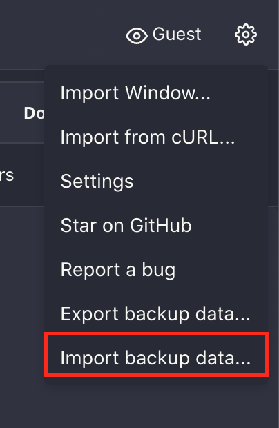
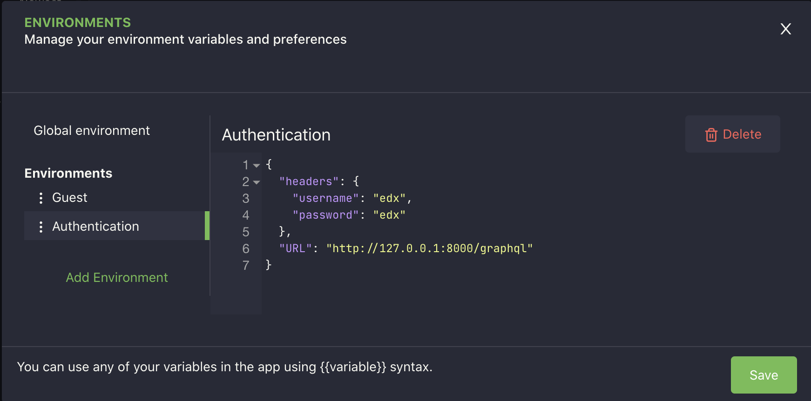

### Testing in Browser
Once the Django server is running `python manage.py runserver`, you can either test APIs in Browser or in the Altair.

In order to test in browser, access the GraphiQL at http://127.0.0.1:8000/graphql in any browser of your choice.
Queries are mentioned under [Guest Environment](#Guest-Environment), copy/page in the query section of the `graphiql` environment of the browser.

Some queries required authenticated users, for this login using Django Admin panel by visiting http://127.0.0.1:8000/admin.

Once Logged in, open the http://127.0.0.1:8000/graphql and copy/pasted the queries mentioned under [Authenticated Environment](#Authenticated-Environment)


### Testing in Altair

### import backup and collection
Altair backup environment and collection's backup can be found at `zee_utils/assets/altair/backup`, to quick start the testing 
you can import those in the following order,
1. Clicking Setting gear and click `Import backup data` and select `calendy_backup.agbkp`


2. Under the collection, click import collection and import `calendy.agc`


After the importing the backup & collection you can skip to [Explore the APIs](#Explore-the-APIs)

### Create New Environments
Open Altair and create two environments, first for guest users and second for authenticated users.
Click the setting gear ICON at the right top corner of the Altair app.


Create two environments named `Guest` & `Authentication`.

### Guest variables looks like this


### Authentication environment looks like this


## Explore the APIs
### Guest Environment
Now select the `Guest` environment and all the following query to list all meetings.
Following APIs can be explored by any guest user.
#### 1. All Meeting
```shell
query{
  allMeetings{
    id
    owner
    startTime
    endTime
    title
    isReserved
    startTime
    meetingDuration
  }
}
```

##### 2. meetings by given user username
```shell
query{
  meetingsByOwner(userName: "edx"){
    id
    startTime
    endTime
    meetingDuration
    isReserved
    owner
  }
}
```

##### 3. Bookable Meetings
```shell
query{
  bookableMeetings{
    id
    owner
    title
    startTime
    endTime
    meetingDuration
  }
}
```

##### 4. Reserve a Meeting
```shell
mutation{
  reserveMeeting: reserveMeeting(
    meetingId: 1, 
    reserverName: "Dave", 
    reserverEmail: "dave@example.om") {
    meeting{
      id
      title
      reserverName
      isReserved
      startTime
      endTime
      meetingDuration
      reserverEmail
      owner
    }
  }
}
```
### Authenticated Environment
In order to create a meeting, switch to `Authentication` environment.

##### 1. Logged in user's Meetings
```shell
query{
  myMeetings{
    id
    startTime
    endTime
    meetingDuration
    isReserved
    reserverName
    reserverEmail
  }
}
```
##### 2. Create a Meeting
```shell
mutation{
  createUpdateMeeting: createUpdateMeeting(
    title: "Automation for QA Team",
    startTime: "2022-10-20T18:15:14+00:00", 
    slotDurationInMinutes:30) {
    meeting {
      title,
      owner,
      startTime,
      endTime,
      meetingDuration
    }
  }
}
```

##### 3. Update a Meeting
In order to create a meeting, switch to `Authentication` environment.
```shell
mutation{
  createUpdateMeeting: createUpdateMeeting(
    title: "The created Via Web",
    startTime: "2022-05-20T18:15:14+00:00", 
    slotDurationInMinutes:45, 
    meetingId:4) 
  {
    meeting {
      title
      owner
      startTime
      endTime
      meetingDuration
    }
  }
}
```

##### 4. Delete A Meeting
```shell
mutation{
  deleteMeeting: deleteMeeting(
    meetingId: 4
  ) {
    message
  }  
}
```
